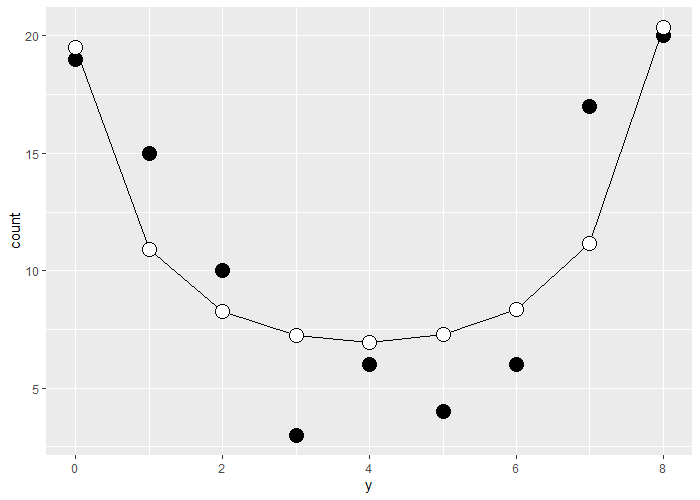

# 目的
- [データ解析のための統計モデリング入門](https://www.amazon.co.jp/dp/400006973X)のWinBUGSで実装されている箇所をstanに置き換えてみる

# 方針
- Rで実装
- WinBUGSで実装されている部分をstanに置き換え
- 本文記載の図はがんばってggplot2で描く

# 第九章

## Rstanを使う
- 個人的な好みの問題で、WinBUGSではなくStanを使うことにする
	- stanコードの書き方はWinBUGSに似ているが、細かいところで異なるところがあるので注意
	- 本文だと著者作成のラッパー関数を使わないといけないのが難点
	- rstanだと一通り関数化されているので簡単
- RStanのインストール方法は[時系列分析と状態空間モデルの基礎: RとStanで学ぶ理論と実装](https://www.amazon.co.jp/dp/4903814874/)に記載がある
	- RStanをインストールすればStanも同時にインストールできるので簡単（ちなみにR3.6系でやや古い、最新のR4.0系だと簡単かも）
	- ただしRtoolsのインストールが必要なので注意
		- [Using Rtools40 on Windows](https://cran.r-project.org/bin/windows/Rtools/)
		- これはR4.0.0以上のみ対応なので、古いバージョンのRにRtoolを入れる場合はドキュメントをちゃんと読むこと
	- Rtoolsがインストール出来たら`install.packages('rstan', dependencies = TRUE)`でrstanを依存パッケージとともにインストール
		- pathの通し方
			- [cxxfunctionのエラーはRtoolsへのパスが原因かも](https://qiita.com/kota9/items/055f5b87e154da4de172)
			- [[質問] Rstanを実行しようとして、Rtools35インストール後、Rが[c:/Rtools/mingw_64/bin/gcc]を認識しない](https://qiita.com/Akio201907/items/a2415e3f18fd95fe560f)
			- こんなエラーが出たら
				- 'makevars_user' is not an exported object from 'namespace:withr' withrをインストールすると良い

## Rstanで本文と同じことをやってみた結果
- stanをやるまえにglmで得られる推定結果を確認する
	- なお、ここで推定しているパラメータはポアソン回帰の回帰係数であり、ポアソン分布のパラメータλではないことに注意する
		- 回帰係数は正規分布を仮定
			- ポアソン分布のλをベイズ推定するのならば、λはガンマ分布を仮定する（ガンマ分布は[0,∞]の範囲の連続値の分布であるため）
		- たぶんこのあたりで混乱しそうな気がする
	- beta_1はちゃんと推定できている
	- beta_2は0に近い値のため、統計的に有意な値にならなかった
	- でもまぁ、良い推定結果にはなっている
```R
> summary(glm_model)

Call:
glm(formula = y ~ x, family = poisson, data = d)

Deviance Residuals: 
     Min        1Q    Median        3Q       Max  
-1.52168  -0.53195   0.06417   0.40797   1.57939  

Coefficients:
            Estimate Std. Error z value Pr(>|z|)    
(Intercept)  1.56606    0.35995   4.351 1.36e-05 ***
x            0.08334    0.06838   1.219    0.223   
```


- stanで推定されたパラメータ
	- beta_1とbeta_2はポアソン回帰の係数
	- lambdaはそれぞれの体サイズxに対して推定されたポアソン分布のパラメータλ(途中割愛、全部で20個ある)
	- yhatはそれぞれの体サイズxに大して推定された種子数yの推定値(途中割愛、全部で20個ある)
``` R
              mean se_mean   sd    2.5%     25%     50%     75%   97.5% n_eff Rhat
beta_1        1.56    0.00 0.08    1.39    1.51    1.56    1.61    1.72   797 1.01
beta_2        0.08    0.00 0.02    0.05    0.07    0.08    0.09    0.12   793 1.01
lambda[1]     1.81    0.00 0.04    1.74    1.79    1.81    1.84    1.89   902 1.01
lambda[2]     1.83    0.00 0.04    1.76    1.81    1.83    1.85    1.90   932 1.01
lambda[3]     1.85    0.00 0.03    1.78    1.83    1.85    1.87    1.91   973 1.01
...
yhat[1]       6.17    0.04 2.48    2.00    4.00    6.00    8.00   11.00  4017 1.00
yhat[2]       6.28    0.04 2.50    2.00    5.00    6.00    8.00   12.00  3773 1.00
yhat[3]       6.40    0.04 2.51    2.00    5.00    6.00    8.00   12.00  3747 1.00
...
lp__       2898.47    0.04 1.04 2895.60 2898.09 2898.80 2899.20 2899.46   849 1.01
```
- パラメータの95%信用区間
``` R
> ## beta_1
> quantile(stan_sampling_res$beta_1,probs = c(0.025,0.5,0.975))
    2.5%      50%    97.5% 
1.394503 1.563062 1.717187 
> ## beta_2
> quantile(stan_sampling_res$beta_2,probs = c(0.025,0.5,0.975))
      2.5%        50%      97.5% 
0.05433440 0.08420478 0.11548769 
```
- 推定されたパラメータの事後分布

- パラメータの同時分布
	- 本文だとbeta_1とbeta_2が独立っぽい感じになっていたが、stanだと相関がある同時分布となった
	- これはおそらくサンプリング方法の違いによるものとおもわれる
		- WinBUGSはギブズサンプリング、Stanはハミルトニアンモンテカルロ法
		- 後述する手作業ギブスサンプリングの結果から考えると、β2の値によってβ1の事後分布が変わるので、むしろ相関がある方が自然と考えて良いか？

- yの推定値の95%信用区間を同時に図示
	- サンプル数が20と非常に少ないので、これくらいばらつきのある推定になっている


# 第十章

## 個体差を考慮した階層ベイズモデル
- 元データと理論値（二項分布）の比較 図10.1の再現


- GLMMで推定した結果。そこそこきれいに推定出来ている



- stanの収束状況


- パラメータの分布
	- 切片0, 標準偏差3くらいになっており、生成データと合致している


- r_iの分布 図10.3のC,D,Eをまねしてみた


- 推定結果と95%信用区間 図10.4の再現


## 個体差と場所差を考慮した階層ベイズモデル
- 元データのプロット 図10.7Bの再現


- stanの収束状況


- パラメータの分布
	- beta_1がやや大きく見積もられているように見えるほかは良く推定出来ている


- 推定結果をもとに再度図10.7Bを描いて見た


- yの推定値のサンプリング結果を鉢ごとのヒストグラムにするとこんな感じになる


# 第十一章

## stan化に失敗？
- intrinsic CARモデルの考え方は理解できた
- しかし、両隣の影響を場所差rに組み込む場合、単純なforループ処理だと「まだ発生させていないrを使って正規分布の平均を算出する」という処理を行ってしまうことになる
	- 例えば、i=2のrを推定したい場合、その平均にr_1とr_3を用いることになるが、forループではまだr_1しか発生させていないため、r_3の値を本来は用いることができない
	- おそらく、WinBUGSのcar.model関数ではそのあたりをうまく処理しているのだと思われるが、stanではcarモデルに相当する組み込み関数が見当たらなかった
	- そこで、いろいろ調べた挙句、両隣ではなくひとつ前の値を参照することとし、r_1はmu_zeroとして推定するようにしている
	- このやり方が正しいとは思わないが、いまできる範囲ではここまでが限界
- 素直にstanで実装するとまともに推定できない状態になったため、上記のように変更してstanを実行、それでもいまいちちゃんと推定できていないっぽい
- もしかしたら[アヒル本](https://www.amazon.co.jp/dp/4320112423)をやった方が良いのかもしれない

``` R
Warning messages:
1: Bulk Effective Samples Size (ESS) is too low, indicating posterior means and medians may be unreliable.
Running the chains for more iterations may help. See
http://mc-stan.org/misc/warnings.html#bulk-ess 
2: Tail Effective Samples Size (ESS) is too low, indicating posterior variances and tail quantiles may be unreliable.
Running the chains for more iterations may help. See
http://mc-stan.org/misc/warnings.html#tail-ess 
```

- 結果一部
``` R
             mean se_mean    sd   2.5%    25%    50%    75%  97.5% n_eff Rhat
beta         1.13    0.71 10.26 -19.31  -5.98   1.41   8.38  20.77   206 1.03
s            0.23    0.00  0.05   0.15   0.20   0.23   0.27   0.35   749 1.01
```

- 平滑化スプラインを使って図11.2を再現


- trace plot


- yの推定値の80%信頼区間をプロット。図11.4っぽくなったが、推定の区間幅は本文よりも大きくなっており、いまいち良い推定ができていないように感じる

